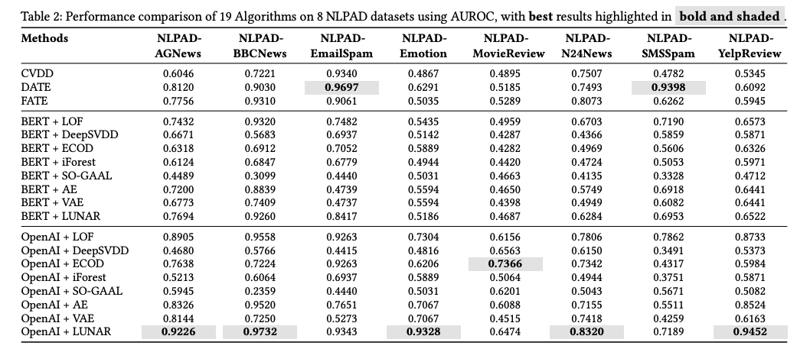

# NLP-ADBench

## Overview

**NLP-ADBench** is a comprehensive benchmarking tool designed for Anomaly Detection in Natural Language Processing (NLP). It not only establishes a benchmark but also introduces the NLPAD datasets—8 curated and transformed datasets derived from existing NLP classification datasets. These datasets are specifically tailored for NLP anomaly detection tasks and presented in a unified standard format to support and advance research in this domain.

To ensure a robust evaluation, NLP-ADBench includes results from 19 algorithms applied to the 8 NLPAD datasets, categorized into two groups:
- 3 end-to-end algorithms that directly process raw text data to produce anomaly detection outcomes. 
- 16 embedding-based algorithms, created by applying 8 traditional anomaly detection methods to text embeddings generated using two models:
  - BERT's `bert-base-uncased`(**BERT**) 
  - OpenAI’s `text-embedding-3-large`(**OpenAI**).





## NLPAD Datasets

The datasets required for this project can be downloaded from the following huggingface links:

1. **NLPAD Datasets**: These are the datasets mentioned in NLP-ADBench paper. You can download them from:

   - [NLP-AD Datasets](https://huggingface.co/datasets/kendx/NLP-ADBench/tree/main/datasets)

2. **Pre-Extracted Embeddings**: For embedding-based algorithms, we have already extracted these embeddings. If you want to use them directly, you can download them from:

   - [Pre-Extracted Embeddings](https://huggingface.co/datasets/kendx/NLP-ADBench/tree/main/embeddings)

## Citation

If you find this work useful, please cite our paper:

[**Paper Link**](https://arxiv.org/abs/2412.04784): https://arxiv.org/abs/2412.04784

```bibtex
@article{li2024nlp,
  title={NLP-ADBench: NLP Anomaly Detection Benchmark},
  author={Li, Yuangang and Li, Jiaqi and Xiao, Zhuo and Yang, Tiankai and Nian, Yi and Hu, Xiyang and Zhao, Yue},
  journal={arXiv preprint arXiv:2412.04784},
  year={2024}
}
```


# Instructions for Running the Benchmark

## Environment Setup Instructions

Follow these steps to set up the development environment using the provided Conda environment file:

1. **Install Anaconda or Miniconda**: 
   Download and install Anaconda or Miniconda from [here](https://docs.conda.io/en/latest/miniconda.html).

2. **Create the Environment**: 
   Using the terminal, navigate to the directory containing the `environment.yml` file and run:
   ```bash
   conda env create -f environment.yml
3. **Activate the Environment**: 
   Activate the newly created environment using:
   ```bash
   conda activate nlpad
   ```


## Import data

Get `Pre-Extracted Embeddings` data from the [huggingface link](https://huggingface.co/datasets/kendx/NLP-ADBench/tree/main/embeddings) and put it in the data folder.

Place all downloaded embeddings data into the `feature` folder in the `./benchmark` directory of this project.

## Run the code
Run the following commands from the `./benchmark` directory of the project:
### BERT
If you want to run a benchmark using data embedded with BERT's `bert-base-uncased` model, use this command:
````bash
python [algorithm_name]_benchmark.py bert
````

### OpenAI
If you want to run a benchmark using data embedded with OpenAI's `text-embedding-3-large` model, use this command:
````bash
python [algorithm_name]_benchmark.py gpt
````

